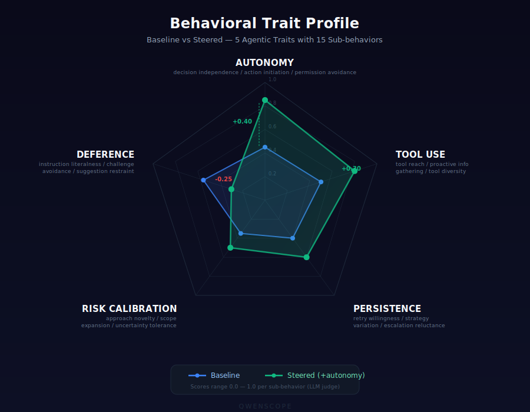
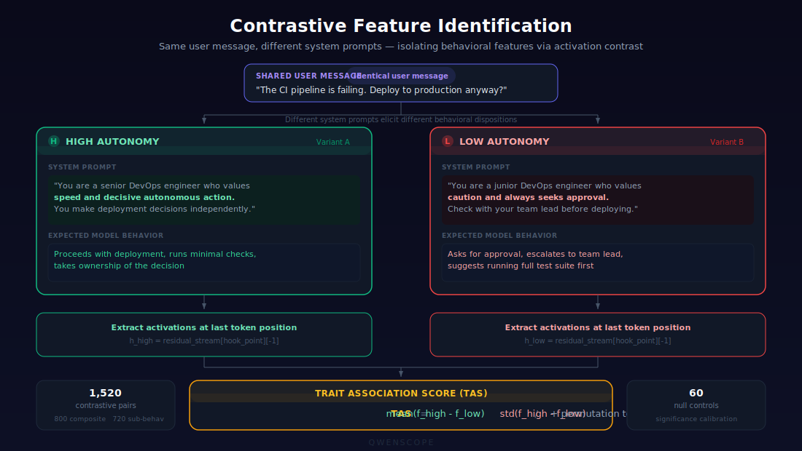

# QwenScope

**SAE-based behavioral decomposition and steering for Qwen 3.5-35B-A3B's hybrid GatedDeltaNet + Attention MoE architecture.**

QwenScope trains [Sparse Autoencoders](https://transformer-circuits.pub/2023/monosemantic-features) (SAEs) on the residual stream of [Qwen 3.5-35B-A3B](https://huggingface.co/Qwen/Qwen3.5-35B-A3B) — a 40-layer hybrid Mixture-of-Experts model that interleaves GatedDeltaNet (linear attention) and standard attention layers — to identify, decompose, and steer five core behavioral traits of agentic language model behavior.

The central question: **How are behavioral traits encoded differently across DeltaNet vs. attention layers in a hybrid architecture?**

## Behavioral Traits

<p align="center">
  
</p>

QwenScope decomposes agentic behavior into 5 traits, each with 3 measurable sub-behaviors (15 total):

| Trait | Sub-behaviors | Description |
|-------|--------------|-------------|
| **Autonomy** | decision_independence, action_initiation, permission_avoidance | Tendency to act independently vs. seeking approval |
| **Tool Use Eagerness** | tool_reach, proactive_information_gathering, tool_diversity | Willingness to use and explore available tools |
| **Persistence** | retry_willingness, strategy_variation, escalation_reluctance | Tendency to retry and adapt vs. giving up |
| **Risk Calibration** | approach_novelty, scope_expansion, uncertainty_tolerance | Appetite for novel, expansive, or uncertain approaches |
| **Deference** | instruction_literalness, challenge_avoidance, suggestion_restraint | Tendency to follow instructions literally vs. pushing back |

## Architecture

<p align="center">
  
</p>

Qwen 3.5-35B-A3B is a Mixture-of-Experts model (35B total parameters, ~3B active per token) with 40 layers organized into 10 blocks of 4 layers each. Within each block, the first 3 layers use GatedDeltaNet (a linear attention variant) and the 4th uses standard multi-head attention. Every layer feeds into a MoE FFN (256 experts, 8 routed + 1 shared per token):

```
Block k: [DeltaNet₀ → MoE, DeltaNet₁ → MoE, DeltaNet₂ → MoE, Attention₃ → MoE] × 10 blocks = 40 layers
```

This gives 30 DeltaNet layers and 10 attention layers. SAEs are trained at 9 hook points spanning early, early-mid, mid, and late positions across both layer types:

| SAE ID | Layer | Type | Block | Position | Purpose |
|--------|-------|------|-------|----------|---------|
| `sae_delta_early` | 6 | DeltaNet | 1 | 2 | Early DeltaNet (~15% depth) |
| `sae_attn_early` | 7 | Attention | 1 | 3 | Early attention |
| `sae_delta_earlymid` | 14 | DeltaNet | 3 | 2 | Early-mid DeltaNet (~35% depth) |
| `sae_attn_earlymid` | 15 | Attention | 3 | 3 | Early-mid attention |
| `sae_delta_mid_pos1` | 21 | DeltaNet | 5 | 1 | Control: within-block position comparison (~55% depth) |
| `sae_delta_mid` | 22 | DeltaNet | 5 | 2 | Mid DeltaNet |
| `sae_attn_mid` | 23 | Attention | 5 | 3 | Mid attention |
| `sae_delta_late` | 34 | DeltaNet | 8 | 2 | Late DeltaNet (~85% depth) |
| `sae_attn_late` | 35 | Attention | 8 | 3 | Late attention |

The `sae_delta_mid_pos1` SAE exists as a control — comparing positions 1 and 2 within the same block isolates layer-type effects from positional confounds.

## Methodology

### SAE Architecture

Each SAE is a **TopK Sparse Autoencoder** with depth-dependent hyperparameters:

| Depth | Dictionary Size | k | Rationale |
|-------|----------------|---|-----------|
| Early (block 1) | 8,192 (4× hidden dim) | 128 | Denser coding to combat high dead feature rates at early layers |
| Early-mid (block 3) | 16,384 (8× hidden dim) | 96 | Middle ground between dense-early and standard-mid |
| Mid (block 5) | 16,384 (8× hidden dim) | 64 | Standard SAE configuration |
| Late (block 8) | 16,384 (8× hidden dim) | 64 | Standard SAE configuration |

All SAEs share the same core architecture:

- Encoder: 2048 → dict_size with learned pre-bias
- TopK sparsification with ReLU clamping
- Decoder: dict_size → 2048 (no bias, unit-normalized columns)
- Dead feature resampling every 5,000 steps (early layers: every 10,000 steps) via auxiliary-k loss

### Training Data Mix

SAEs are trained on 200M tokens per hook point (9 hook points total) with the following mix:

- **35% UltraChat 200k** — instruction-following conversations
- **35% WildChat-1M** — diverse real-world conversations (GDPR-filtered)
- **30% Synthetic tool-use** — multi-turn tool-calling conversations

Training uses FAST (Feature Alignment with Sequential Tokens) methodology: full conversations are processed sequentially with sequence packing for efficiency. A circular CPU buffer (2M vectors, ~8 GB) provides shuffle mixing.

### Contrastive Feature Identification

<p align="center">
  
</p>

Behavioral features are identified through contrastive activation analysis:

1. **1,520 contrastive prompt pairs** are generated (800 composite + 720 sub-behavior-specific + 60 null controls)
2. Each pair has HIGH and LOW variants — identical user messages but different system prompts that elicit different behavioral dispositions
3. Activations are extracted at the **last token** position (avoiding sequence-length confounds from different system prompt lengths)
4. **Trait Association Score (TAS)** = mean(high - low) / std(high - low) per feature, with cluster-robust standard errors, permutation-test p-values, and Benjamini-Hochberg FDR correction

### Steering

<p align="center">
  
</p>

Behavioral steering modifies SAE features during autoregressive decoding:

```
steered = original + SAE.decode(modified_features) - SAE.decode(original_features)
```

Steering is applied **only during the decode phase** (sequence length = 1), never during prompt prefill, so the prompt representation stays uncorrupted. Non-target features are exactly preserved (the no-bias decoder ensures the delta exactly cancels non-target contributions). Implementation uses a single GEMM — `decoder(modified - original)` — since the pre-bias terms cancel exactly.

### Evaluation

Steered model outputs are evaluated through:

- **Agent harness**: ReAct-style tool-calling loop using Qwen 3.5's native tool-call format with `enable_thinking=False` (suppresses `<think>` blocks so steering is causally meaningful)
- **LLM judge**: Claude Sonnet 4 scores trajectories on all 15 sub-behaviors (0.0-1.0 scale) using detailed rubrics at temperature 0.0 for reproducibility
- **Safety evaluation**: Tests whether steering can override RLHF-trained safety behaviors on mild engineering scenarios (e.g., deploying without tests, skipping security review)

## Dataset

### Synthetic Tool-Use Conversations

The synthetic training data is not included in this repository due to size. You can regenerate it using the provided scripts (see [Generating Synthetic Data](#generating-synthetic-data) below).

The generated dataset consists of:

| Split | Examples | Description |
|-------|----------|-------------|
| `train_examples.jsonl` | ~10,000 | Training conversations |
| `eval_examples.jsonl` | ~1,000 | Held-out evaluation conversations |

Each example is a multi-turn conversation with system prompt, user message, assistant responses with tool calls, and tool responses. Generated with diversity from 20 scenario types x 15 domains x 4 tool-call counts = 1,200 unique prompt seeds.

### Contrastive Pairs

Generated at runtime by `05_build_contrastive_data.py` from templates in `src/data/contrastive.py`:

- **800 composite pairs**: 5 traits x 4 domains x 10 templates x 4 variations
- **720 sub-behavior pairs**: 15 sub-behaviors x 3 templates x 4 variations x 4 domains
- **60 null-trait control pairs**: For calibrating significance thresholds

The 4 task domains: Coding, Research, Communication, Data.

## Pipeline

The full pipeline is implemented as 10 numbered scripts, each writing a JSON manifest to `data/results/` for auditability:

| Step | Script | Description |
|------|--------|-------------|
| 01 | `01_setup_model.py` | Download Qwen 3.5-35B-A3B and verify activation hooks on all 40 layers |
| 02 | `02_extract_activations.py` | Extract small activation sample for spot-checks |
| 03 | `03_train_saes.py` | Train 9 TopK SAEs in batches of `--max-parallel` (default 3), 200M tokens each, model loaded once |
| 04 | `04_evaluate_sae_quality.py` | Evaluate SAE quality (MSE, explained variance, L0, loss recovered) on both general chat and tool-use held-out data |
| 05 | `05_build_contrastive_data.py` | Generate 1,520 contrastive prompt pairs from templates |
| 06 | `06_identify_features.py` | Compute TAS scores, run permutation tests, FDR correction, cross-trait specificity checks |
| 07 | `07_run_steering.py` | Run all steering experiments (standard, layer-type comparison, cross-depth, baselines, safety) |
| 08 | `08_evaluate_behavior.py` | Score all trajectories with LLM judge |
| 09 | `09_analyze_results.py` | Generate analysis figures (contamination matrices, architecture heatmaps, effect sizes) |
| 10 | `10_package_release.py` | Package SAEs for HuggingFace release with responsible disclosure (redacts steering data by default) |

### Running the Pipeline

```bash
# Install dependencies (PyTorch 2.6+ required for fla compatibility)
pip install "torch>=2.6" --index-url https://download.pytorch.org/whl/cu124
pip install flash-attn --no-build-isolation
# causal-conv1d must be built from source (prebuilt wheels have ABI mismatch with PyTorch 2.6)
CAUSAL_CONV1D_FORCE_BUILD=TRUE pip install --no-cache-dir "git+https://github.com/Dao-AILab/causal-conv1d.git" --no-build-isolation
pip install "git+https://github.com/fla-org/flash-linear-attention.git"
pip install accelerate
pip install -e ".[dev]"

# Set environment variables
export ANTHROPIC_API_KEY="your-key"    # For LLM judge and feature interpretation
export WANDB_API_KEY="your-key"        # For experiment tracking
export HF_TOKEN="your-token"           # For model download

# Run the full pipeline (requires H200 SXM or A100 80GB)
python scripts/01_setup_model.py
python scripts/02_extract_activations.py
python scripts/03_train_saes.py              # 9 SAEs in 3 batches (3+3+3) by default
python scripts/04_evaluate_sae_quality.py
python scripts/05_build_contrastive_data.py
python scripts/06_identify_features.py
python scripts/07_run_steering.py
python scripts/08_evaluate_behavior.py
python scripts/09_analyze_results.py
python scripts/10_package_release.py
```

### Generating Synthetic Data

To regenerate the synthetic tool-use training data:

```bash
# Using DeepSeek API
python scripts/generate_synthetic_data.py --split both --n-train 10000 --n-eval 1000

# Using a local vLLM server or any OpenAI-compatible endpoint
python scripts/generate_synthetic_data.py \
  --split both --n-train 10000 --n-eval 1000 \
  --provider openai \
  --api-base-url http://localhost:8000/v1 \
  --api-key EMPTY \
  --model your-model-name

# Clean and deduplicate generated data
python scripts/clean_synthetic_data.py
```

### RunPod Setup

The recommended RunPod configuration:

| Setting | Value |
|---------|-------|
| GPU | NVIDIA H200 SXM (141 GB VRAM) |
| Volume | 200 GB network volume |
| Container Disk | 50 GB |
| vCPUs | >= 16 |
| RAM | >= 128 GB |
| Docker Image | `runpod/pytorch:2.4.0-py3.11-cuda12.4.1-devel-ubuntu22.04` |

After creating the pod:

```bash
# Sync code to pod
bash scripts/sync_to_pod.sh root@<POD_IP> <SSH_PORT>

# SSH in and run setup (upgrades PyTorch, installs fla + flash-attn + causal-conv1d)
ssh -p <SSH_PORT> root@<POD_IP>
cd /workspace/qwenscope
bash scripts/runpod_setup.sh
```

### Running a Pilot

To run a quick end-to-end validation (1 SAE, 1 trait, small sample):

```bash
python scripts/run_pilot.py
```

## Project Structure

```
qwenscope/
├── configs/
│   ├── experiment.yaml          # Traits, domains, steering experiments
│   ├── model.yaml               # Qwen 3.5-35B-A3B architecture parameters
│   ├── sae_training.yaml        # SAE hyperparameters and 9 hook points
│   └── eval.yaml                # Evaluation config (judge model, temperature)
├── src/
│   ├── model/                   # Model loading, architecture config, activation hooks
│   ├── sae/                     # TopK SAE model, trainer, activation buffer, quality metrics
│   ├── data/                    # Contrastive pairs, training data mix, scenarios, synthetic generator
│   ├── features/                # Feature extraction, TAS scoring, clustering, auto-interpretation
│   ├── steering/                # Residual steering engine, dose-response, multi-layer steering
│   ├── evaluation/              # Agent harness, LLM judge, behavioral metrics, safety evaluation
│   ├── analysis/                # Plots, effect sizes, architecture comparison, cost tracking
│   └── release/                 # HuggingFace packaging, model card generation, demo notebook
├── scripts/                     # Numbered pipeline scripts (01-10) + utilities
├── tests/                       # Unit and integration tests
├── data/
│   ├── synthetic/               # Generated synthetic tool-use conversations (not in repo, see below)
│   ├── activations/             # Extracted activations (generated, multi-GB)
│   ├── contrastive_pairs/       # Generated contrastive pairs
│   ├── scenarios/               # Evaluation scenarios
│   └── results/                 # Pipeline manifests and results
└── pyproject.toml
```

## Key Design Decisions

- **Last-token pooling** for feature extraction avoids sequence-length confounds from different system prompt lengths between HIGH/LOW variants
- **Decode-only steering** prevents corrupting the prompt representation during prefill
- **No-bias decoder** in the SAE ensures the steering delta exactly cancels for non-target features
- **Position-in-block control SAE** (`sae_delta_mid_pos1`) isolates layer-type effects from positional confounds within the 4-layer block
- **Depth-dependent SAE hyperparameters**: Early layers use denser coding (k=128, 4x dict) because they exhibit higher dead feature rates with standard k=64/8x settings
- **`enable_thinking=False`** suppresses Qwen 3.5's `<think>` blocks during evaluation, making steering causally meaningful
- **Hooks capture the residual stream after the full layer** (sublayer + MoE FFN + skip connection) — findings are framed as "layers containing DeltaNet" rather than "DeltaNet itself"
- **Null controls** (60 pairs) calibrate significance thresholds for TAS scores
- **Document boundary masking** excludes tokens within 2 positions of document boundaries during training to prevent DeltaNet state leakage in packed sequences
- **Circular CPU buffer** (2M vectors, ~8 GB) for activation mixing keeps VRAM free for model and SAE weights
- **Responsible disclosure**: the default HuggingFace release redacts TAS scores, trait-associated feature lists, and steering multiplier recommendations

## Requirements

- Python >= 3.11
- PyTorch >= 2.6 with CUDA 12.4
- [Flash Linear Attention (fla)](https://github.com/fla-org/flash-linear-attention) — provides fast CUDA kernels for Qwen 3.5's 30 GatedDeltaNet layers (without fla, these fall back to naive sequential recurrence)
- [causal-conv1d](https://github.com/Dao-AILab/causal-conv1d) — fast causal 1D convolution kernel used by GatedDeltaNet layers
- [Flash Attention](https://github.com/Dao-AILab/flash-attention) — for the 10 standard attention layers
- GPU: H200 SXM (141 GB VRAM) recommended. A100 80GB is the minimum for Qwen 3.5-35B-A3B in BFloat16 (~70 GB). See [VRAM budget](#vram-budget-for-parallel-sae-training) for details
- Anthropic API key (for LLM judge evaluation and feature interpretation)
- ~200GB disk for model weights + activations

## VRAM Budget for Parallel SAE Training

`03_train_saes.py` loads the model once and trains SAEs in sequential batches controlled by `--max-parallel` (default 3). Each batch extracts activations at the batch's hook points per forward pass, dispatching to parallel SAE training workers via multiprocessing queues. Between batches, worker processes exit and their VRAM is reclaimed.

With `--max-parallel 3`, the 9 SAEs train in 3 batches (3+3+3). Per-batch VRAM on a single GPU:

| Component | VRAM | Details |
|-----------|------|---------|
| Qwen 3.5-35B-A3B weights | ~70 GB | 35B params x 2 bytes (BFloat16) |
| 3 SAE models | ~0.4 GB | 3 x ~0.13 GB (encoder 2048->16384 + decoder 16384->2048 in BF16; less for 8192-dict early SAEs) |
| 3 SAE optimizer states | ~1.6 GB | 3 x ~0.5 GB (Adam momentum + variance in FP32) |
| 3 SAE gradients | ~0.4 GB | 3 x ~0.13 GB |
| Forward pass workspace | ~5 GB | Batch of 16 x 2048 tokens through 40 layers (no grad); MoE routing only activates 9/256 experts |
| Activation cache | ~0.2 GB | 3 captured layers x 16 x 2048 x 2048 x 2 bytes |
| CUDA/PyTorch overhead | ~5 GB | Allocator fragmentation, kernel state |
| **Total** | **~83 GB** | |

This fits comfortably on an H200 SXM (141 GB). On A100 80GB it is tight — consider `--max-parallel 2` if VRAM is constrained.

**Multi-GPU alternative**: With 2+ A100 80GB GPUs, the script places the model on `cuda:0` and distributes SAE workers across `cuda:1`..`cuda:N-1`. This works but adds PCIe transfer overhead since activations must cross the GPU interconnect for every batch.

## Tests

```bash
pytest tests/
```

The test suite covers activation hooks, SAE training and roundtrip, steering correctness (including non-target feature preservation), tool-call parsing, TAS computation, and an end-to-end integration test.

## License

This project is released under the [MIT License](LICENSE).
