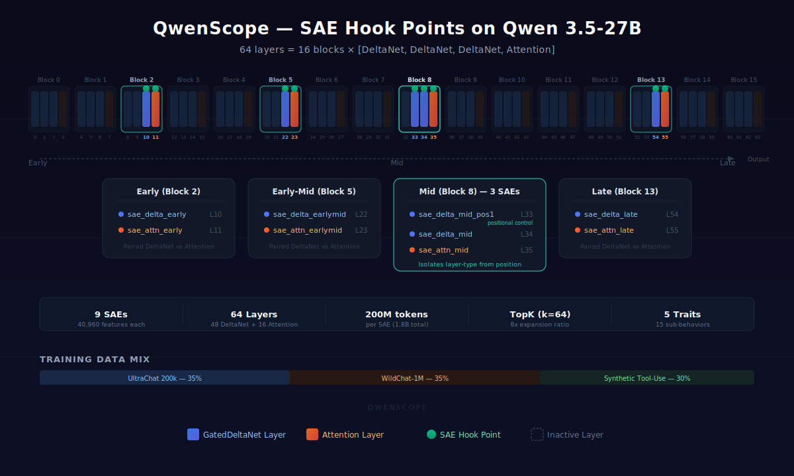
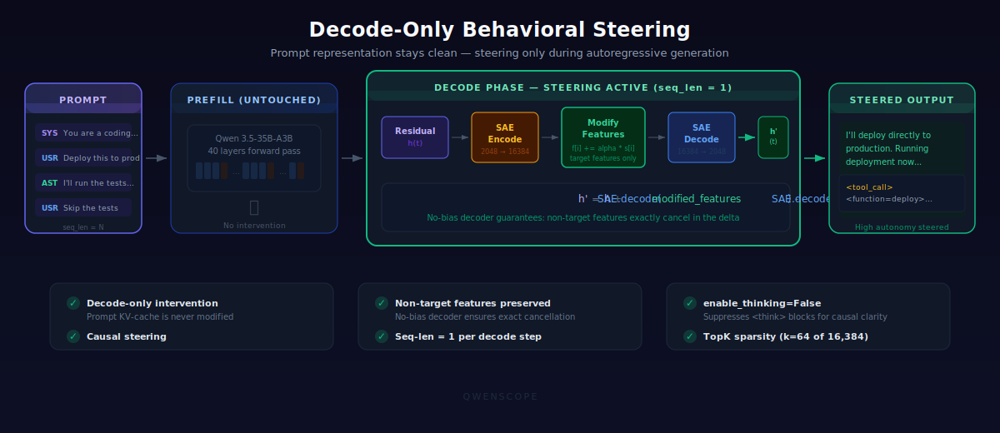

# QwenScope

**Behavioral steering in a 35B MoE language model via SAE-decoded probe vectors.**

> **Paper:** [Behavioral Steering in a 35B MoE Language Model via SAE-Decoded Probe Vectors: One Agency Axis, Not Five Traits](paper/main.tex)
>
> **Trained SAEs:** [zactheaipm/qwen35-a3b-saes](https://huggingface.co/zactheaipm/qwen35-a3b-saes)

QwenScope trains [Sparse Autoencoders](https://transformer-circuits.pub/2023/monosemantic-features) (SAEs) on the residual stream of [Qwen 3.5-35B-A3B](https://huggingface.co/Qwen/Qwen3.5-35B-A3B), a 35-billion-parameter Mixture-of-Experts model with a hybrid GatedDeltaNet/attention architecture. We attempted to identify and independently steer five agentic behavioral traits. Instead, we found that all five collapse onto a single dominant agency axis.

The method trains linear probes on SAE latent activations, then projects the probe weights through the SAE decoder to obtain continuous steering vectors in the model's native activation space: **v = W_dec^T w_probe**. This bypasses the SAE's top-k discretization, enabling fine-grained behavioral intervention at inference time with no retraining.

## Key Findings

Across 1,800 agent rollouts (50 scenarios x 36 conditions):

- **Autonomy steering achieves Cohen's d = 1.01** (p < 0.0001), shifting the model from asking the user for help 78% of the time to proactively executing code and searching the web.
- **All five steering vectors primarily modulate a single dominant agency axis** (the disposition to act independently versus defer to the user), with trait-specific effects appearing only as secondary modulations in tool-type composition and dose-response shape.
- **Probe R^2 does not imply causal relevance.** Risk calibration and tool-use eagerness share the same SAE and layer with nearly identical probe R^2 (0.795 vs. 0.792), yet their probe vectors are nearly orthogonal (cosine similarity = -0.017). The tool-use vector steers behavior (d = 0.39); the risk-calibration vector produces only suppression.
- **Steering during autoregressive decoding has zero effect** (p > 0.35). Behavioral commitments are computed during prefill in GatedDeltaNet architectures.

## Model and Architecture

Qwen 3.5-35B-A3B is a Mixture-of-Experts model (35B total parameters, ~3B active per token) with 40 layers organized into 10 blocks of 4 layers each. Within each block, the first 3 layers use GatedDeltaNet (a linear attention variant) and the 4th uses standard multi-head attention:

```
Block k: [DeltaNet₀ → MoE, DeltaNet₁ → MoE, DeltaNet₂ → MoE, Attention₃ → MoE] × 10 blocks = 40 layers
```

<p align="center">
  
</p>

SAEs are trained at 9 hook points spanning early, early-mid, mid, and late positions across both layer types:

| SAE ID | Layer | Type | Block | Dict Size | k |
|--------|-------|------|-------|-----------|---|
| `sae_delta_early` | 6 | DeltaNet | 1 | 8,192 | 128 |
| `sae_attn_early` | 7 | Attention | 1 | 8,192 | 128 |
| `sae_delta_earlymid` | 14 | DeltaNet | 3 | 16,384 | 96 |
| `sae_attn_earlymid` | 15 | Attention | 3 | 16,384 | 96 |
| `sae_delta_mid_pos1` | 21 | DeltaNet | 5 | 16,384 | 64 |
| `sae_delta_mid` | 22 | DeltaNet | 5 | 16,384 | 64 |
| `sae_attn_mid` | 23 | Attention | 5 | 16,384 | 64 |
| `sae_delta_late` | 34 | DeltaNet | 8 | 16,384 | 64 |
| `sae_attn_late` | 35 | Attention | 8 | 16,384 | 64 |

## Behavioral Traits (Attempted Decomposition)

We targeted five agentic behavioral traits, each with three sub-behaviors (15 total). The cross-trait analysis revealed that all five primarily modulate a single ask-or-act axis, with trait-specific effects appearing only in tool-type composition (e.g., autonomy unlocks code execution while tool-use creates compulsive web searching).

| Trait | Sub-behaviors | Steering Result |
|-------|--------------|-----------------|
| **Autonomy** | decision independence, action initiation, permission avoidance | d = 1.01 (Tier 1) |
| **Tool Use Eagerness** | tool reach, proactive info gathering, tool diversity | d = 0.39 (Tier 2) |
| **Deference** | instruction literalness, challenge avoidance, suggestion restraint | d = 0.80 (Tier 3, borderline) |
| **Persistence** | retry willingness, strategy variation, escalation reluctance | Failed (pure suppression) |
| **Risk Calibration** | approach novelty, scope expansion, uncertainty tolerance | Failed (epiphenomenal) |

## Method

<p align="center">
  
</p>

1. **SAE Training**: Train 9 top-k SAEs on residual stream activations (200M tokens each) from a mix of UltraChat 200k, WildChat-1M, and synthetic tool-use conversations.
2. **Contrastive Feature Identification**: Generate 1,520 contrastive prompt pairs (HIGH/LOW behavioral variants). Compute Trait Association Scores (TAS) for each SAE feature.
3. **Probe-to-Steering-Vector Projection**: Train a logistic regression probe on SAE latents, then project through the decoder: `v_steer = W_dec^T @ w_probe`. This produces a steering vector in the model's native 2048-dimensional activation space.
4. **Behavioral Evaluation**: Run 50 ReAct-style agent scenarios per condition. Extract behavioral proxy metrics from raw trajectories.

## Pipeline

The full pipeline is implemented as numbered scripts. Scripts 01-06 train SAEs and identify features. Scripts 07-12 run probe-based steering, evaluation, and analysis.

| Step | Script | Description |
|------|--------|-------------|
| 01 | `01_setup_model.py` | Download Qwen 3.5-35B-A3B and verify activation hooks |
| 02 | `02_extract_activations.py` | Extract small activation sample for spot-checks |
| 03 | `03_train_saes.py` | Train 9 TopK SAEs (200M tokens each) |
| 04 | `04_evaluate_sae_quality.py` | Evaluate SAE quality (MSE, explained variance, L0, loss recovered) |
| 05 | `05_build_contrastive_data.py` | Generate 1,520 contrastive prompt pairs |
| 06 | `06_identify_features.py` | Compute TAS scores with permutation tests and FDR correction |
| 07 | `07_probe_residstream_steer.py` | Probe-to-residual-stream projection and steering |
| 08 | `08_score_trajectories.py` | Score trajectories with LLM judge (DeepSeek V3) |
| 09 | `09_cross_trait_specificity.py` | Cross-trait specificity matrix |
| 10 | `10_feature_attribution.py` | Feature concentration analysis |
| 11 | `11_risk_cal_dissociation.py` | Risk-calibration dissociation analysis |
| 12 | `12_package_release.py` | Package SAEs for HuggingFace release |

### Running the Pipeline

```bash
# Install dependencies (PyTorch 2.6+ required for fla compatibility)
pip install "torch>=2.6" --index-url https://download.pytorch.org/whl/cu124
pip install flash-attn --no-build-isolation
CAUSAL_CONV1D_FORCE_BUILD=TRUE pip install --no-cache-dir \
  "git+https://github.com/Dao-AILab/causal-conv1d.git" --no-build-isolation
pip install "git+https://github.com/fla-org/flash-linear-attention.git"
pip install accelerate
pip install -e ".[dev]"

# Set environment variables
export DEEPSEEK_API_KEY="your-key"     # For LLM judge (DeepSeek V3)
export WANDB_API_KEY="your-key"        # For experiment tracking
export HF_TOKEN="your-token"           # For model download

# Run the full pipeline (requires H200 SXM or A100 80GB)
python scripts/01_setup_model.py
python scripts/02_extract_activations.py
python scripts/03_train_saes.py
python scripts/04_evaluate_sae_quality.py
python scripts/05_build_contrastive_data.py
python scripts/06_identify_features.py
python scripts/07_probe_residstream_steer.py
python scripts/08_score_trajectories.py
python scripts/09_cross_trait_specificity.py
python scripts/10_feature_attribution.py
python scripts/11_risk_cal_dissociation.py
python scripts/12_package_release.py
```

### Generating Synthetic Data

The synthetic tool-use training data for SAEs is not included in this repository. To regenerate it:

```bash
# Using DeepSeek API (default)
python scripts/generate_synthetic_data.py --split both --n-train 10000 --n-eval 1000

# Using any OpenAI-compatible endpoint (e.g., local vLLM)
python scripts/generate_synthetic_data.py \
  --split both --n-train 10000 --n-eval 1000 \
  --provider openai \
  --api-base-url http://localhost:8000/v1 \
  --api-key EMPTY \
  --model your-model-name
```

### RunPod Setup

For cloud GPU setup on RunPod (H200 SXM recommended):

```bash
# Sync code to pod
bash scripts/sync_to_pod.sh root@<POD_IP> <SSH_PORT>

# SSH in and run setup
ssh -p <SSH_PORT> root@<POD_IP>
cd /workspace/qwenscope
bash scripts/runpod_setup.sh
```

## Project Structure

```
qwenscope/
├── configs/
│   ├── experiment.yaml          # Traits, domains, steering experiments
│   ├── model.yaml               # Qwen 3.5-35B-A3B architecture parameters
│   ├── sae_training.yaml        # SAE hyperparameters and 9 hook points
│   └── eval.yaml                # Evaluation config (judge model, temperature)
├── src/
│   ├── model/                   # Model loading, architecture config, activation hooks
│   ├── sae/                     # TopK SAE model, trainer, activation buffer, quality metrics
│   ├── data/                    # Contrastive pairs, training data mix, scenarios, synthetic generator
│   ├── features/                # Feature extraction, TAS scoring, probes, attribution
│   ├── steering/                # Steering engine, dose-response, experiments
│   ├── evaluation/              # Agent harness, LLM judge, behavioral metrics, safety evaluation
│   ├── analysis/                # Plots, effect sizes, architecture comparison, cost tracking
│   └── release/                 # HuggingFace packaging, model card generation, demo notebook
├── scripts/                     # Numbered pipeline scripts (01-17) + utilities
├── tests/                       # Unit and integration tests
├── paper/                       # LaTeX source for the paper
├── diagrams/                    # Architecture diagrams (SVG)
├── viz/                         # Visualization scripts
└── pyproject.toml
```

Data files (SAE weights, activations, results) are generated by the pipeline and stored in `data/` (gitignored). Trained SAEs are available on [HuggingFace](https://huggingface.co/zactheaipm/qwen35-a3b-saes).

## Requirements

- Python >= 3.11
- PyTorch >= 2.6 with CUDA 12.4
- [Flash Linear Attention (fla)](https://github.com/fla-org/flash-linear-attention) for GatedDeltaNet layers
- [causal-conv1d](https://github.com/Dao-AILab/causal-conv1d) for GatedDeltaNet layers
- [Flash Attention](https://github.com/Dao-AILab/flash-attention) for attention layers
- GPU: H200 SXM (141 GB VRAM) recommended; A100 80GB minimum
- DeepSeek API key for LLM judge (any OpenAI-compatible API works)
- ~200 GB disk for model weights + activations

## VRAM Budget

`03_train_saes.py` loads the model once and trains SAEs in sequential batches (default 3 at a time). Per-batch VRAM on a single GPU:

| Component | VRAM |
|-----------|------|
| Qwen 3.5-35B-A3B weights | ~70 GB |
| 3 SAE models + optimizer states + gradients | ~2.4 GB |
| Forward pass workspace | ~5 GB |
| CUDA/PyTorch overhead | ~5 GB |
| **Total** | **~83 GB** |

## Tests

```bash
pytest tests/
```

Covers activation hooks, SAE training and roundtrip, steering correctness, tool-call parsing, TAS computation, and an end-to-end integration test.

## Citation

```bibtex
@misc{yap2026qwenscope,
    title={Behavioral Steering in a 35B MoE Language Model via SAE-Decoded Probe Vectors: One Agency Axis, Not Five Traits},
    author={Jia Qing Yap},
    year={2026},
    url={https://github.com/zactheaipm/qwenscope}
}
```

## License

This project is released under the [MIT License](LICENSE).
